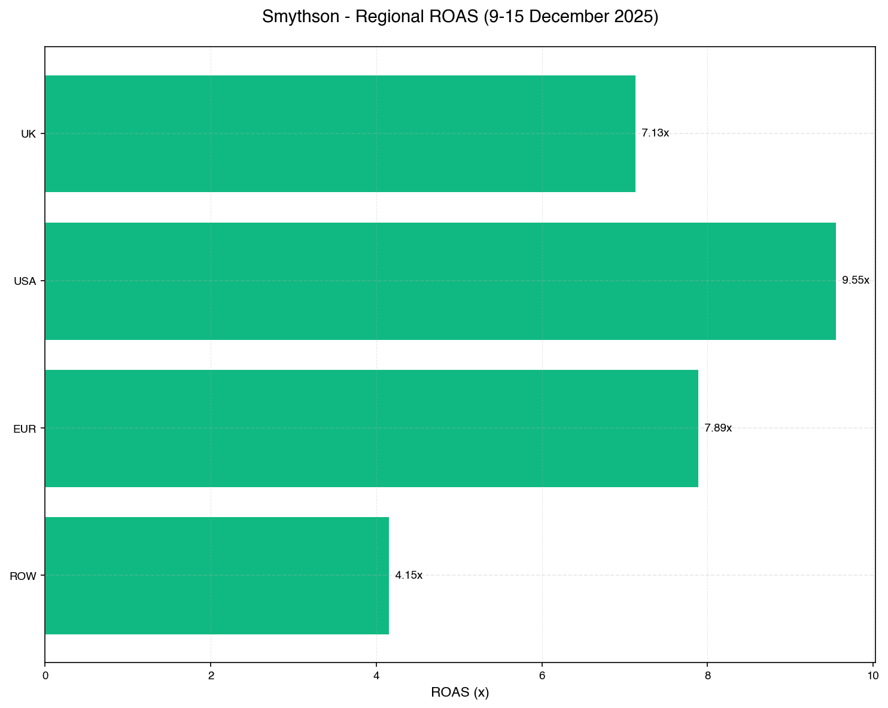
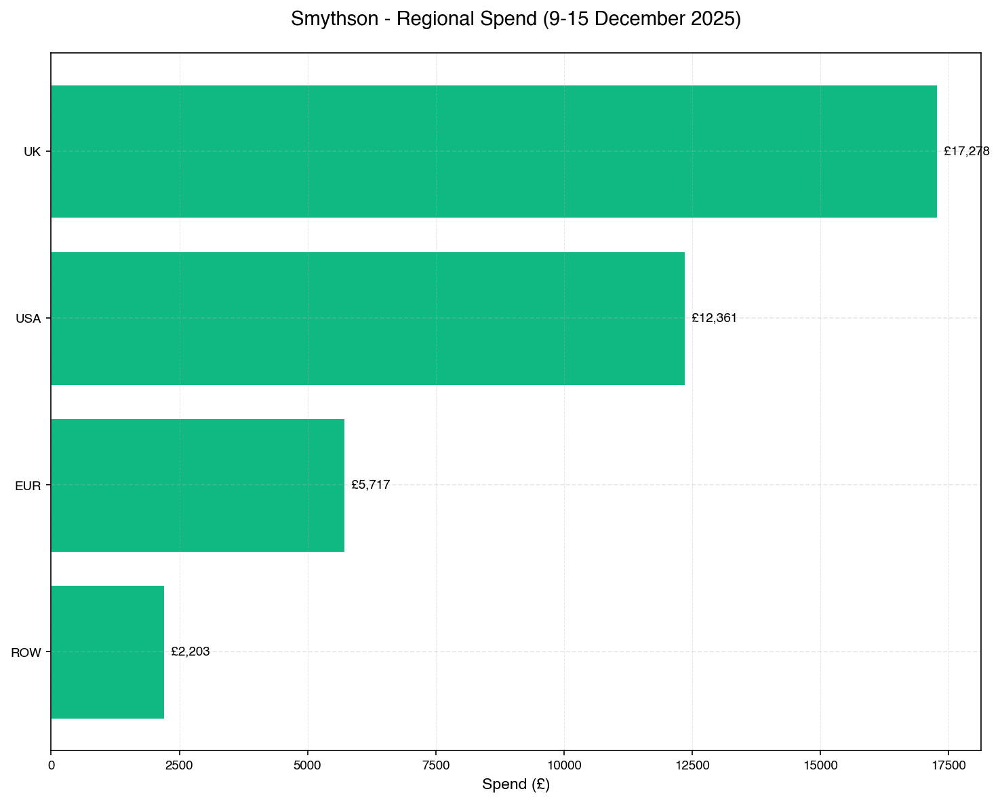
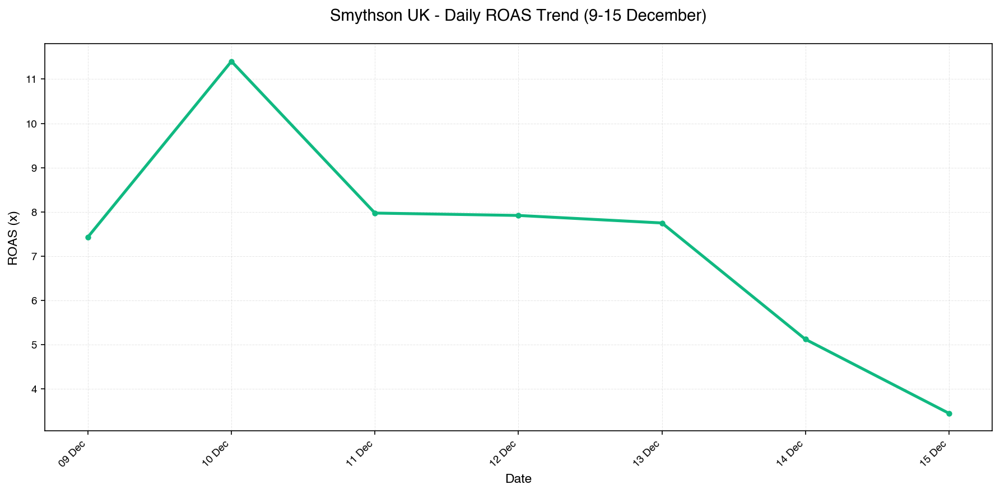

# Smythson Weekly Report - 9-15 December 2025
**Generated:** 16 December 2025 at 09:38

---

## 🎯 OVERALL SUMMARY - Q4 PLAN TRACKING

### Q4 Progress
- **Days Elapsed:** 48 of 62 (77.4% through Q4)
- **Days Remaining:** 14 days

### Spend vs Plan

| Metric | Value | Status |
|--------|-------|--------|
| Q4 Total Budget | £521,052 | Target |
| Expected at Day 48 | £403,395 | (77% of budget) |
| **Actual to Date** | **£348,309** | **86.3% paced** |
| Variance | £-55,086 | UNDER-paced by 13.7% |

### Revenue vs Target

| Metric | Value | Status |
|--------|-------|--------|
| Q4 Revenue Target | £2,720,970 | Target |
| Expected at Day 48 | £2,106,557 | (77% of target) |
| **Actual to Date** | **£2,443,538** | **116.0% of expected** |
| Variance | £336,980 | AHEAD by 16.0% |

### ROAS Performance

| Metric | Value |
|--------|-------|
| Q4 Target ROAS | 5.47x |
| Q4 Actual ROAS (to date) | 7.02x |
| This Week ROAS | 7.87x |
| Last Week ROAS | 7.70x |

**✅ Key Takeaway:** Revenue 116.0% of expected target with only 86.3% of budget used. ROAS of 7.02x significantly exceeds target of 5.47x.

---

## 📊 THIS WEEK PERFORMANCE (9-15 December)

### Total Account

| Metric | This Week | Last Week | Change | Trend |
|--------|-----------|-----------|--------|-------|
| Spend | £37,559.27 | £41,938.56 | -10.4% | ╲╲╲╲╱╱ |
| Revenue | £295,637.94 | £323,035.95 | -8.5% | ╱╲─╲╲╲ |
| ROAS | 7.87x | 7.70x | +0.17x | – |
| Conversions | 1503 | 1718 | -12.5% | – |

---

## 🌍 REGIONAL BREAKDOWN

### UK (Primary Market)

| Metric | This Week | Last Week | WoW Change |
|--------|-----------|-----------|------------|
| Spend | £17,278.48 | £23,517.13 | -26.5% |
| Revenue | £123,251.63 | £145,620.09 | -15.4% |
| ROAS | 7.13x | 6.19x | +0.94x |
| Conversions | 838 | 1055 | -20.6% |

### USA

| Metric | This Week | Last Week | WoW Change |
|--------|-----------|-----------|------------|
| Spend | £12,361.21 | £12,931.56 | -4.4% |
| Revenue | £118,125.54 | £123,794.28 | -4.6% |
| ROAS | 9.55x | 9.57x | -0.02x |
| Conversions | 431 | 413 | +4.2% |

### EUR

| Metric | This Week | Last Week | WoW Change |
|--------|-----------|-----------|------------|
| Spend | £5,716.78 | £3,767.72 | +51.7% |
| Revenue | £45,112.01 | £42,533.70 | +6.1% |
| ROAS | 7.89x | 11.29x | -3.40x |
| Conversions | 152 | 163 | -6.8% |

### ROW

| Metric | This Week | Last Week | WoW Change |
|--------|-----------|-----------|------------|
| Spend | £2,202.80 | £1,722.15 | +27.9% |
| Revenue | £9,148.76 | £11,087.88 | -17.5% |
| ROAS | 4.15x | 6.44x | -2.29x |
| Conversions | 83 | 88 | -4.9% |

---

## 📈 CHARTS

### Regional ROAS Comparison

### Regional Spend Distribution

### UK Daily ROAS Trend

---

## 💡 KEY INSIGHTS

1. **Q4 Target on Track:** Revenue at 116.0% of expected with only 86.3% budget used - highly efficient performance
2. **Spend Reduction:** Total spend down 10.4% WoW (UK -26.5%, EUR +51.7%, ROW +27.9%)
3. **ROAS Improvement:** Overall ROAS up from 7.70x to 7.87x (+2.2%)
4. **USA Strong Performance:** USA maintaining excellent 9.55x ROAS (vs UK 7.13x)
5. **EUR Growth:** EUR spend increased significantly (+51.7%) with maintained strong ROAS of 7.89x

---

## 🎯 RECOMMENDATIONS

### Priority 1: UK Market
- **Issue:** UK spend dropped 26.5% WoW while ROAS improved to 7.13x (well above target)
- **Action:** Investigate budget constraints - opportunity to increase UK budget given strong ROAS
- **Impact:** Potential £5K-£10K additional weekly revenue

### Priority 2: Q4 Finish Strong
- **Issue:** 14 days remaining, £172K budget available (£12.3K/day)
- **Action:** Review daily spend targets per region to fully utilize Q4 budget
- **Impact:** Ensure maximum Q4 revenue capture while maintaining ROAS >5.47x

### Priority 3: ROW Performance
- **Issue:** ROW ROAS at 4.15x (below Q4 target of 5.47x)
- **Action:** Review ROW campaign structure and targeting efficiency
- **Impact:** Improve profitability or consider budget reallocation to higher-ROAS markets

---

**Next Review:** 23 December 2025
